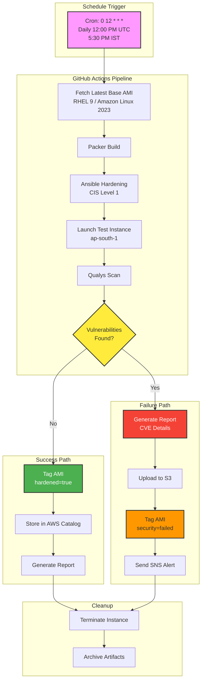

# AMI DevOps Pipeline - ap-south-1 Region

## Overview
Fully automated CI/CD pipeline for building, hardening, and scanning Amazon Machine Images (AMIs) in the **ap-south-1 (Mumbai) region**.

## Features
- 🚀 **Automated Daily Builds** at 12:00 PM UTC (5:30 PM IST)
- 🔒 **Security Hardening** using Ansible (CIS Level 1 compliance)
- 🔍 **Vulnerability Scanning** with Qualys integration
- 📊 **Comprehensive Reporting** in HTML, CSV, and JSON formats
- 🏷️ **Smart AMI Tagging** based on security scan results
- 🌏 **Region Specific** - Optimized for ap-south-1 (Mumbai)
- 🔐 **Branch Protection** and code ownership
- 📧 **Notifications** via SNS (optional)

## Quick Start

### Prerequisites

1. **AWS Setup** (ap-south-1 region):
```bash
# Configure AWS CLI
aws configure --profile production
# Set region to ap-south-1

## Architecture Diagram

